### Краткое описание 

Представлены экраны принетра.

1. Loading screen

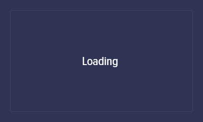

2. Home

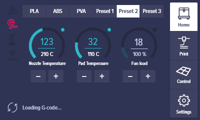

3. Print

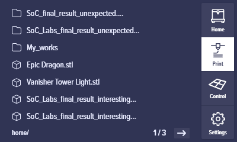

4. Print (Inside folder)

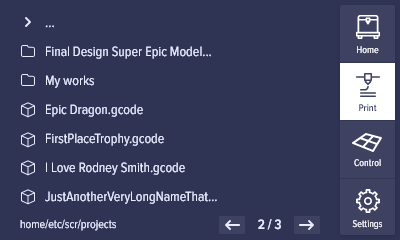

5. Control

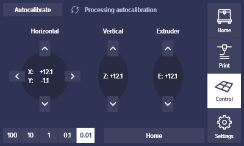

6. Printing

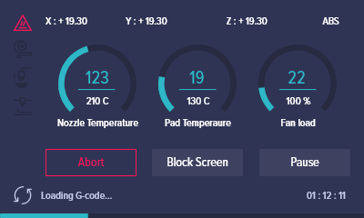

7. Printing is done

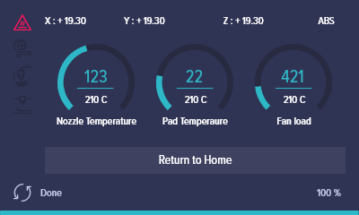

8. Print settings

9. Settings: General

10. Settings Preprint presets setup

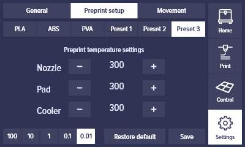

11. Settings: Moving – Speed

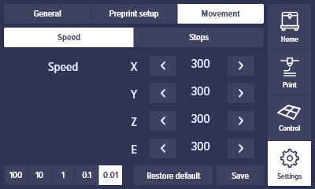

12. Settings: Moving – Steps

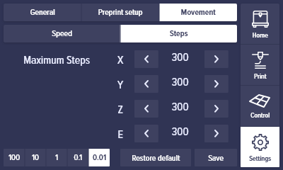

13. Warning

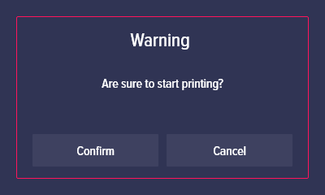

14. Attention

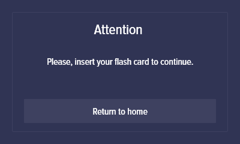
