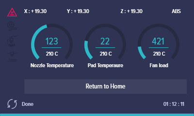
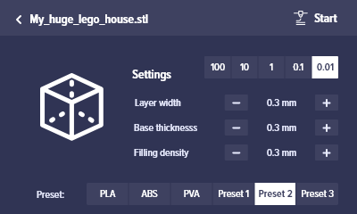
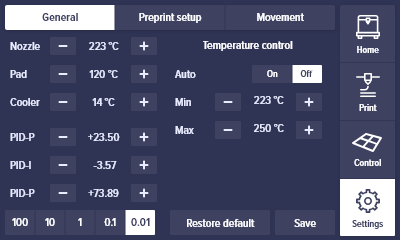
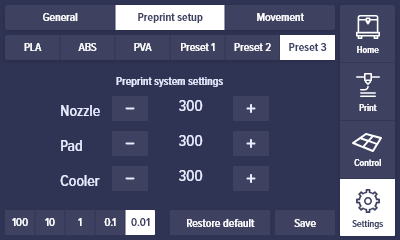

### Краткое описание 

Представлены экраны принетра.

1. Loading screen

2. Home

3. Print

4. Print (Inside folder)

 - Inside Folder.png)

5. Control

6. Printing

7. Printing is done

8. Print settings

9. Settings: General

10. Settings Preprint presets setup

11. Settings: Moving – Speed

12. Settings: Moving – Steps

13. Warning

14. Attention

